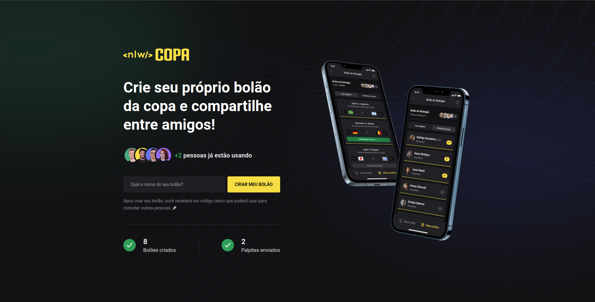
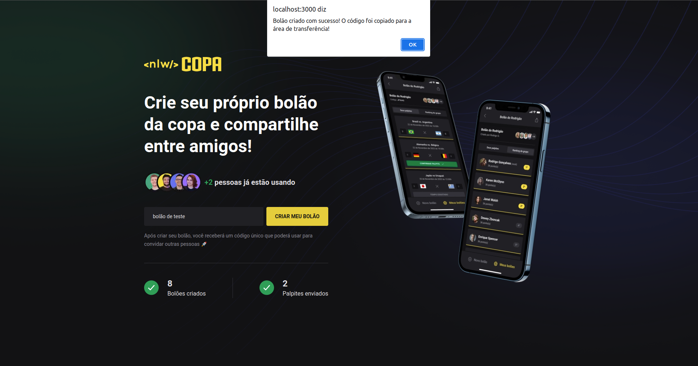
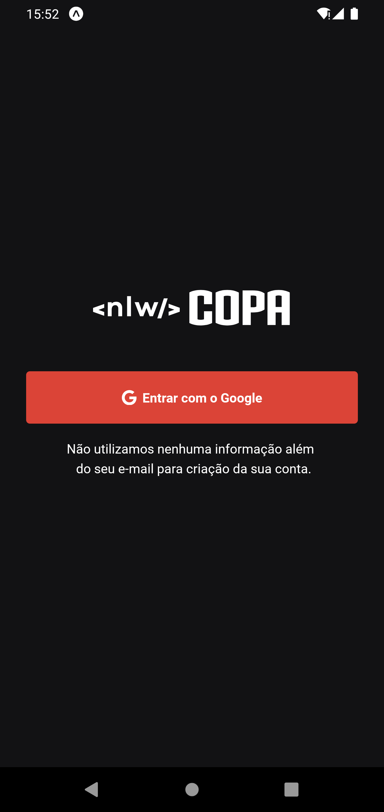
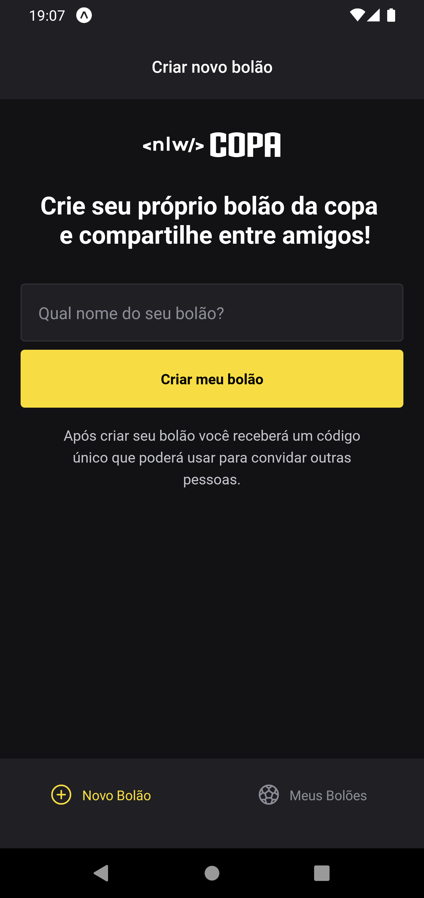
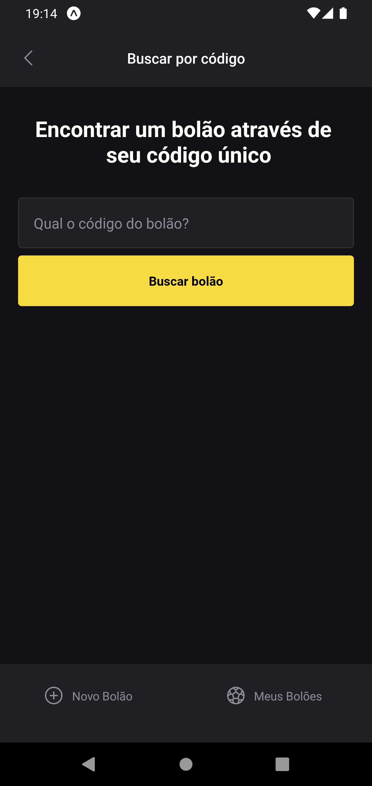
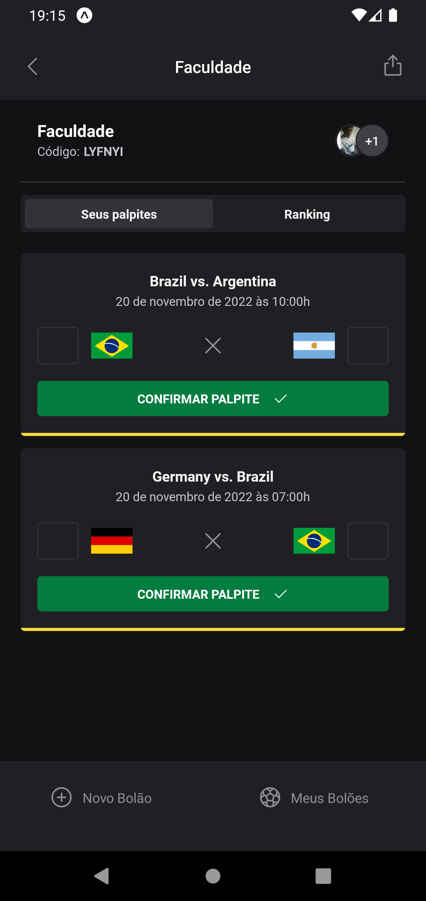
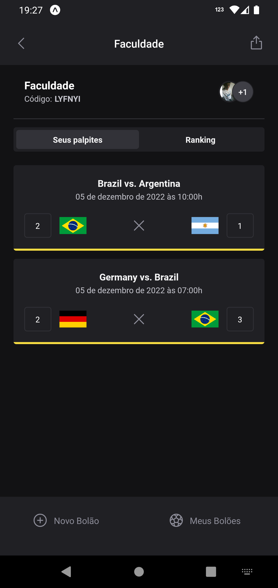
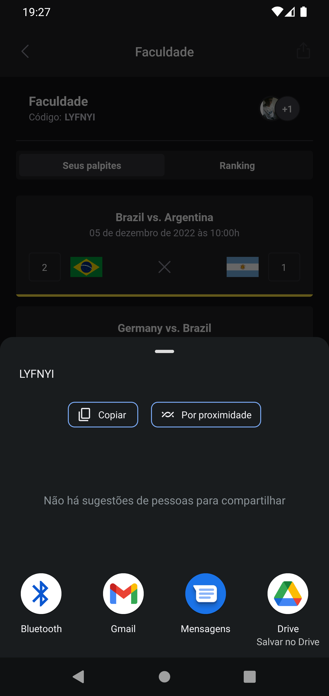

<p align="center">
  
  <br>
</p>
<h3 align="center">
  Seja você o craque dessa copa!
</h3>

<br><br>

<p align="center">
  
  
  
  
</p>
<br>

<p align="center">
  <a href="#sobre">Sobre</a> •
  <a href="#nlw-copa">NLW Copa</a> •
  <a href="#instalação">Instalação</a> •
  <a href="#tecnologias">Tecnologias</a> •
  <a href="#autor">Autor</a>  
</p>

<br>

## Sobre

Projeto desenvolvido durante a NLW Copa, evento criado pela RocketSeat. Um evento 100% online e GRATUITO, com conteúdo exclusivo e INÉDITO.

Ocorreu do dia 31 de Outubro ao dia 07 de Novembro de 2022 e teve como intuito mostrar na prática o poder da stack NodeJS + ReactJS + React Native e como essas tecnologias podem te levar até os seus maiores objetivos como programador.


## NLW Copa

Em clima de copa do mundo, a ultima edição da NLW de 2022 veio com o proposito de construirmos uma aplicação para criação de bolão e brincarmos com nossos amigos enquanto curtimos o maior evento esportivo do planeta.
A aplicação do bolão possui interface web, aplicação móvel e o backend próprio criado do zero para atender todos os requisitos necessários para entregar a experiencia planejada pela aplicação. Vamos conhecer a aplicação nos tópicos a seguir e entender como ela funciona.

### Landing Page

A landing page da aplicação tem como objetivo apresentar de forma breve o projeto e tornar publico dados como: a quantidade de bolões criados e palpites dados na aplicação, conforme vemos abaixo:



A única funcionalidade presente na web é a criação de um novo bolão. Para isso, basta preencher o campo com o nome desejado e clicar em **Criar meu bolão** e pronto, um novo bolão será criado e seu respectivo código de convite será copiado para a area de transferência do usuário, conforme podemos notar no alerta da imagem abaixo:



### Aplicação móvel

A aplicação móvel, além da criação de bolão, contempla as demais funcionalidades esperadas por um aplicação com esse proposito, as quais serão mostradas a seguir.

Ao acessar o app, o usuário será direcionado para a tela de login, que é feito através de uma conta Google:



Após realizar o login, o usuário será direcionado para a home da aplicação. A primeira tela exibida será a de criação de bolão, cujo proposito é o mesmo da página web. Para realizar a criação basta informar o nome desejado e clicar no botão logo abaixo do campo, conforme ilustrado abaixo:



Na barra de navegação no inferior da tela, podemos alternar para a aba **Meus bolões**, aonde estarão listados todos os bolões ao qual o usuário logado está participando, conforme imagem abaixo:


No topo da tela, antes da listagem, temos a opção de buscar um bolão pelo código de convite que recebemos ao criar um bolão, seja pela web ou mobile. Para ingressar em um novo bolão, basta informar o seu código e clicar no botão para concluir o ingresso:



Ao entrar em um bolão no qual o usuário é participante, logo no inicio serão exibidos os jogos disponíveis para palpite. Nos jogos já palpitados serão exibidos os placares sugeridos pelo usuário e não editáveis, para os jogos ainda não palpitados o usuário poderá inserir o placar e confirmar no campo que será exibido abaixo de cada jogo, conforme podemos ver a seguir:

|                                Jogos ainda não palpitados                                |                                       Jogos já palpitados                                       |
| :--------------------------------------------------------------------------------------: | :---------------------------------------------------------------------------------------------: |
|  |  |

Na tela do bolão além dos palpites temos também uma aba para ranking do bolão, porém não implementada. Para fecharmos nossa aplicação, temos a funcionalidade de copiar e compartilhar o código para novos participantes entrarem no bolão. Para isso, basta clicar no botão presente no canto superior direito, ao clicar teremos o resultado abaixo, basta escolher a forma que queremos compartilhar o código e enviar para os novos potenciais participantes:



## Instalação

Antes de começar, você vai precisar ter instalado em sua máquina as seguintes ferramentas:
[Git](https://git-scm.com), [Node.js](https://nodejs.org/en/).
Além disto é bom ter um editor para trabalhar com o código como [VSCode](https://code.visualstudio.com/).

### 🎲 Rodando o Back End (servidor)

```bash
# Clone este repositório
$ git clone git@github.com:MrRioja/nlw-copa.git

# Acesse a pasta do projeto no terminal/cmd
$ cd nlw-copa

# Vá para a pasta server
$ cd server

# Instale as dependências
$ npm install
# Caso prefira usar o Yarn execute o comando abaixo
$ yarn

# Execute a aplicação em modo de desenvolvimento
$ npm run dev
# Caso prefira usar o Yarn execute o comando abaixo
$ yarn dev

# O servidor inciará na porta 3333 - acesse <http://localhost:3333>
```

### 🖥️ Rodando o Front End (Web)

```bash
# Clone este repositório
$ git clone git@github.com:MrRioja/nlw-copa.git

# Acesse a pasta do projeto no terminal/cmd
$ cd nlw-copa

# Vá para a pasta server
$ cd web

# Instale as dependências
$ npm install
# Caso prefira usar o Yarn execute o comando abaixo
$ yarn

# Execute a aplicação em modo de desenvolvimento
$ npm run dev
# Caso prefira usar o Yarn execute o comando abaixo
$ yarn dev

# O servidor inciará na porta 3000 - acesse <http://localhost:3000>
```

### 📱 Rodando o App (Mobile)

```bash
# Clone este repositório
$ git clone git@github.com:MrRioja/nlw-copa.git

# Acesse a pasta do projeto no terminal/cmd
$ cd nlw-copa

# Vá para a pasta server
$ cd mobile

# Instale as dependências
$ npm install
# Caso prefira usar o Yarn execute o comando abaixo
$ yarn

# Execute a aplicação
$ expo start

# Será aberto no terminal o menu do Expo onde poderá scanear o QR Code para executar o app diretamente no seu celular ou as opções de executar no emulador android ou iOS
```

## Tecnologias


<br><br><br><br><br><br>

## Autor

<div align="center">

<h1>Luiz Rioja</h1>
<strong>Backend Developer</strong>
<br/>
<br/>

<a href="https://linkedin.com/in/luizrioja" target="_blank">

</a>

<a href="https://github.com/mrrioja" target="_blank">

</a>

<a href="mailto:lulyrioja@gmail.com?subject=Fala%20Dev" target="_blank">

</a>

<a href="https://api.whatsapp.com/send?phone=5511933572652" target="_blank">

</a>

<a href="https://join.skype.com/invite/tvBbOq03j5Uu" target="_blank">

</a>

<br/>
<br/>
</div>
